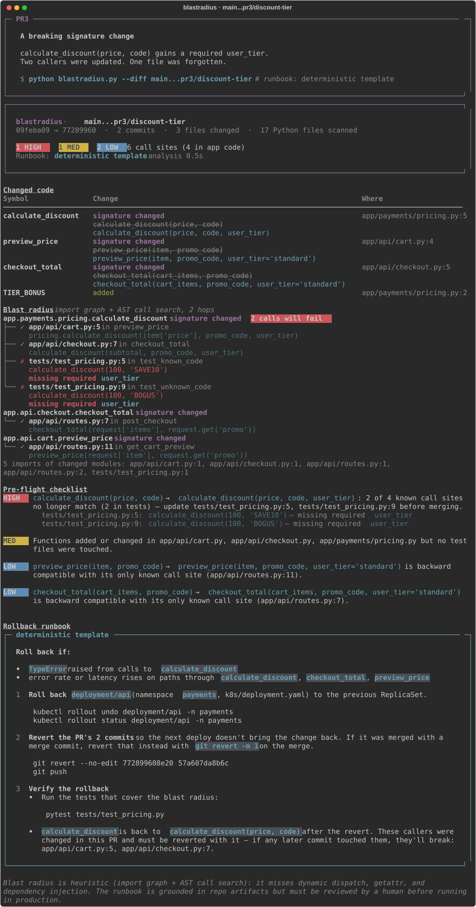
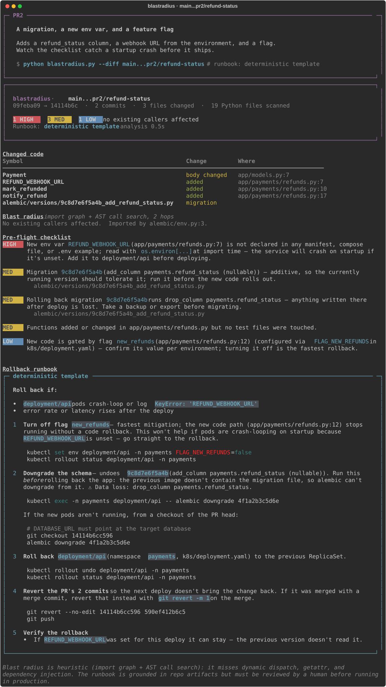
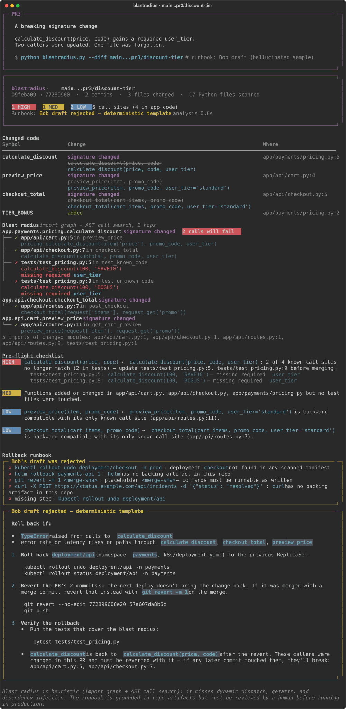

# blastradius

**Rollback plans written before the deploy, from the actual diff. Not from memory five minutes into an incident.**

Give it a git range. It traces every call site the change actually touches, builds a pre-flight checklist specific to *this* diff, and writes a rollback runbook using the real deployment names, migration revisions, and commit SHAs from your repo. IBM Bob improves the runbook, and a validator rejects anything Bob says that isn't grounded in the repo.

```
python backend/main.py --repo backend/demo_repo --diff main...pr3/discount-tier
```



The analysis runs in about half a second; Bob adds 10–15 seconds. In a terminal you get the view above. With `--out` you get markdown to paste into the PR description.

<details><summary>More screenshots: PR 2 (migration + env var + flag), and a hallucinated Bob draft being rejected</summary>





</details>

### Live demo

**https://blastradius-eqlp.onrender.com** runs the dashboard on the three demo PRs (hosted on Render's free plan: the first visit after it has been idle takes about a minute to wake up).

- The backend (`render.yaml`) seeds the demo repo at build time and serves the dashboard and API from one origin.
- `frontend/index.html` also works on its own, opened as a file or hosted anywhere: its `blastradius-api` meta tag points at the Render backend, which allows cross-origin calls. Override it with `?api=https://your-backend`.
- Bob mode needs `BOB_API_KEY` set in the Render service's environment. Without it the dashboard offers template runbooks and the rejection demo. The public backend accepts only real branch names and runs one Bob analysis at a time.

---

## Quickstart

Requires Python 3.11+ and git.

```bash
python -m venv .venv
.venv/Scripts/python -m pip install -e "backend/[dev]"   # macOS/Linux: .venv/bin/python

python backend/demo/seed_demo.py --force                  # builds demo_repo/ with 3 example PRs
python backend/main.py --repo backend/demo_repo --diff main...pr3/discount-tier --no-llm
```

## The three demo PRs

`backend/demo/seed_demo.py` builds a small payments service (Alembic, Kubernetes manifest, GitHub Actions deploy) with a fixed git history. The SHAs are identical on every machine.

| Branch | Change | What the tool reports |
|---|---|---|
| `pr1/pagination-fix` | Off-by-one fix in `paginate()` | 1 app caller, one LOW item, rollback = `kubectl rollout undo` + `git revert`. It doesn't cry wolf. |
| `pr2/refund-status` | Alembic migration + new env var + feature flag | **HIGH**: `REFUND_WEBHOOK_URL` is read at import and not in the k8s manifest, so pods will crash on startup. Runbook: flag off → `alembic downgrade 4f1a2b3c5d6e` (from the *new* pods, because the old image doesn't have the migration file) → rollout undo → revert. Warns that the downgrade drops `refund_status` data. |
| `pr3/discount-tier` | `calculate_discount(price, code)` → `(price, code, user_tier)` | All 4 call sites by file:line with the actual call text. **HIGH**: 2 calls in `tests/test_pricing.py` no longer match (missing `user_tier`). The 2 wrappers that gained a *defaulted* `user_tier` are correctly marked backward compatible. |

### Presenting

`backend/demo/present.py` plays the three scenarios with a title card and a pause before each:

```bash
python backend/demo/present.py                    # live Bob
python backend/demo/present.py --no-llm           # no network needed
python backend/demo/present.py --only pr3         # just the centerpiece
python backend/demo/present.py --rejection        # PR 3 with a hallucinated Bob draft

# stage-safe: record live Bob drafts, review them, then replay them exactly
python backend/demo/present.py --save-drafts backend/demo/bob_drafts
python backend/demo/present.py --replay backend/demo/bob_drafts
```

A spinner names each stage as it runs ("Tracing callers…", "Asking Bob…", "Validating Bob's draft…"), so the split between the fixed analysis and Bob is visible live. Regenerate the screenshots with `python backend/demo/present.py --svg docs`.

## How it works

```
git range
   │
   ▼
Diff parser ──────────── AST diff: added / removed / signature / body changes
   │
   ├─▶ Blast radius ──── import graph + AST call search at the head revision, 2 hops
   ├─▶ Repo facts ────── migrations, k8s workloads, env vars, flags, compose, CI
   │
   ▼
Checklist ────────────── rules; every item cites file:line / revision / env var
   │
   ▼
Runbook: template ─▶ Bob ─▶ validator ─▶ (reject → template)
   │
   ▼
Markdown report
```

**Deterministic where it's about facts, agentic where it's about explanation.**

- **Blast radius, checklist, and the template runbook use no LLM.** They come from Python's `ast` module and `git`, so they're reproducible and explainable.
- **Bob gets a constrained job.** It receives the facts, the checklist, and a working template runbook, and is asked to improve the explanation, the signals, and the per-step checks. It isn't asked to invent a runbook.
- **Every command Bob writes is validated** against the facts scanned from the repo. Unknown deployment or namespace, unknown SHA or revision, a tool with no backing file (`helm` without a chart, `curl` to an invented URL), invented HTTP routes, `<placeholders>`, and dropped critical steps are all rejected. The report then uses the template and lists why:

```bash
python backend/main.py --repo backend/demo_repo --diff main...pr3/discount-tier \
    --bob-output backend/demo/bob_samples/pr3_hallucinated.md
```

```
Why the Bob draft was not used
- `kubectl rollout undo deployment/checkout -n prod`: deployment `checkout` not found in any scanned manifest
- `helm rollback payments-api 1`: `helm` has no backing artifact in this repo
- `git revert -m 1 <merge-sha>`: placeholder `<merge-sha>` — commands must be runnable as written
- `curl -X POST https://status.example.com/...`: `curl` has no backing artifact in this repo
- missing step: `kubectl rollout undo deployment/api`
```

(`backend/demo/bob_samples/` holds hand-written examples of a good and a bad LLM draft. They're used for offline rehearsal and tests, not actual Bob output.)

## CLI

```
python backend/main.py --diff BASE...HEAD [options]

  --repo PATH          target repo (default: cwd)
  --out FILE           write markdown to a file instead of the terminal
  --format md|json     json gives the full structured report
  --hops 1|2           caller search depth (default 2)
  --no-llm             skip Bob; use the deterministic runbook
  --bob-output FILE    use a saved Bob response instead of calling the API
  --dump-prompt FILE   write the exact prompt sent to Bob
  --fail-on high|med|low   exit 1 if the checklist has items at that level (for CI)
  --plain              raw markdown even on a terminal
```

Exit codes: `0` ok, `1` `--fail-on` threshold hit, `2` bad git range or repo.

### Bob configuration

The runbook step calls Bob's OpenAI-compatible API. Put your key in `.env` (loaded automatically) or the environment:

```
BOB_API_KEY=...
```

Everything else has defaults (see `.env.example`): `BOB_API_URL` (`https://api.us-east.bob.ibm.com/inference/v1`), `BOB_MODEL` (`premium`), `BOB_INSTANCE_ID`/`BOB_TEAM_ID` (routing headers some accounts need), `BOB_AUTH_SCHEME` (`Apikey`), `BOB_TIMEOUT_SECONDS`, `BOB_USER_AGENT`.

Check connectivity with:

```bash
python backend/main.py --bob-check     # lists available models and sends a test prompt
```

If the key is missing, or the call fails or times out, the tool prints a warning and uses the template runbook. A report is always produced.

> The API is behind Cloudflare, which blocks generic client user agents (`Python-urllib`, `curl`) with an HTML 403. The default `BOB_USER_AGENT` identifies this tool as a Bob client and passes.

## What the checklist catches

| Rule | Example |
|---|---|
| `SIGNATURE_CHANGED` | Checks every call site against the new signature: missing required args, too many positionals, unknown or duplicate keywords, keyword-only params. |
| `SYMBOL_REMOVED` | A removed function that's still imported or called somewhere at head. |
| `BEHAVIOR_CHANGED` | Body changed and app code depends on it (names the callers). |
| `MIGRATION` | Risky ops (drops, renames, NOT NULL without default, raw SQL) vs. additive ones. |
| `MIGRATION_NO_DOWNGRADE` / `_ROLLBACK_DATA_LOSS` | Empty `downgrade()`, irreversible `RunPython`, rollback that drops columns. |
| `NEW_ENV_VAR` | New `os.environ[...]` / `getenv` reads, cross-checked against k8s, compose, Dockerfile, and `.env.example`. Read at import time = crash on startup. |
| `FEATURE_FLAG` | New code behind a flag, and which env var controls it. |
| `NO_TESTS`, `DEPS_CHANGED`, `DEPLOY_CONFIG_CHANGED`, `PARSE_ERROR` | Named files, never generic advice. |

Supported artifacts: Alembic and Django migrations, Kubernetes Deployments/StatefulSets/DaemonSets, docker compose, Dockerfiles, GitHub Actions workflows, `.env.example`.

## Limitations

- **Heuristic call search, not a full call graph.** It resolves imports, aliases, relative imports, and package re-exports, but misses `getattr`, dynamic dispatch, and dependency injection. Instance method calls (`obj.m()`) are reported as low confidence.
- **Single repo, Python only.** No cross-service tracing.
- **The runbook is grounded, not guaranteed.** A human should review it before running anything in production. The tool never runs commands itself.

## Development

```bash
cd backend
../.venv/Scripts/python -m pytest                          # 146 tests, ~55s
UPDATE_GOLDEN=1 ../.venv/Scripts/python -m pytest tests/test_report.py   # accept report changes
```

`backend/tests/golden/` holds the full expected report for each demo PR. Because the demo SHAs are deterministic, these are byte-for-byte comparisons.

## Repository layout

```
IBM-BOB_2.0/
├── backend/
│   ├── blastradius/          # Python package
│   │   ├── cli.py            # entry point, orchestration, exit codes
│   │   ├── gitio.py          # git plumbing
│   │   ├── diff_parser.py    # AST diff of changed symbols
│   │   ├── import_graph.py   # repo-wide import graph
│   │   ├── callers.py        # alias-aware call-site search
│   │   ├── blast_radius.py   # hop-1 / hop-2 orchestration
│   │   ├── artifacts.py      # migrations, k8s, env vars, flags → RollbackFacts
│   │   ├── checklist.py      # pre-flight rule registry
│   │   ├── report.py         # markdown / JSON output
│   │   ├── terminal.py       # rich terminal view
│   │   ├── viewmodel.py      # JSON view model for the web dashboard
│   │   ├── runbook/          # template, Bob prompt + backends, validator
│   │   └── web/              # HTTP server (serves frontend/index.html)
│   ├── demo/
│   │   ├── seed_demo.py      # builds demo_repo/ with 3 PR branches
│   │   ├── present.py        # stage runner, SVG export
│   │   └── bob_samples/      # hand-written good / bad Bob drafts
│   ├── tests/                # pytest suite (146 tests)
│   ├── main.py               # entry shim: python backend/main.py --diff ...
│   └── pyproject.toml
├── frontend/
│   └── index.html            # self-contained web dashboard (no build step)
├── docs/                     # screenshots and SVGs
├── .env.example
├── .gitignore
├── PLAN.md
└── README.md
```
